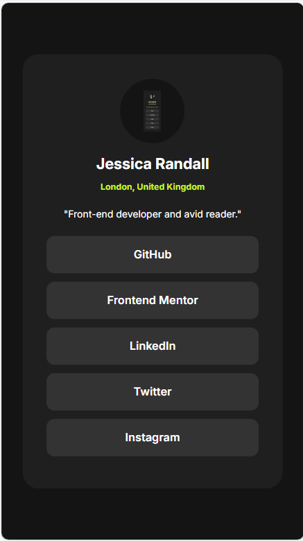

# Frontend Mentor - Social links profile solution

This is a solution to the [Social links profile challenge on Frontend Mentor](https://www.frontendmentor.io/challenges/social-links-profile-UG32l9m6dQ). Frontend Mentor challenges help you improve your coding skills by building realistic projects. 

## Table of contents

- [Overview](#overview)
  - [The challenge](#the-challenge)
  - [Screenshot](#screenshot)
  - [Links](#links)
- [My process](#my-process)
  - [Built with](#built-with)
  - [What I learned](#what-i-learned)
  - [Continued development](#continued-development)
  - [Useful resources](#useful-resources)
- [Author](#author)
- [Acknowledgments](#acknowledgments)

## Overview

### The challenge

Users should be able to:

- See hover and focus states for all interactive elements on the page

### Screenshot

### Links

- Solution URL: [Add solution URL here](https://your-solution-url.com)
- Live Site URL: [https://vuthoai02.github.io/social-links-profile/](https://vuthoai02.github.io/social-links-profile/)

## My process

### Built with

- Semantic HTML5 markup
- CSS custom properties
- Flexbox
- CSS Grid
- Mobile-first workflow

### What I learned
In this project, I learned how to effectively use CSS to style hover states for interactive elements. Specifically, I learned how to change the color of text inside an anchor tag when its parent list item is hovered. This enhances the user experience by providing visual feedback on interactive elements.

### Continued development
Moving forward, I want to continue improving my skills in responsive design and accessibility. Ensuring that my projects are usable and accessible to all users, regardless of their device or abilities, is a priority for me. I also plan to explore more advanced CSS techniques and JavaScript to add more interactivity to my projects.

### Useful resources 
- [CSS-Tricks](https://css-tricks.com/) - This site provides a wealth of information on CSS techniques and best practices.
- [Frontend Mentor](https://www.frontendmentor.io/) - The challenges on this site have been instrumental in helping me improve my coding skills through practical, real-world projects.

## Author
- Frontend Mentor - [@vuthoai02](https://www.frontendmentor.io/profile/vuthoai02)

## Acknowledgments
I would like to thank the Frontend Mentor community for their support and feedback. The challenges and resources provided have been incredibly helpful in my development journey.

